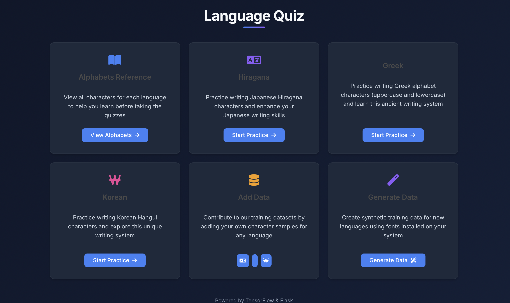
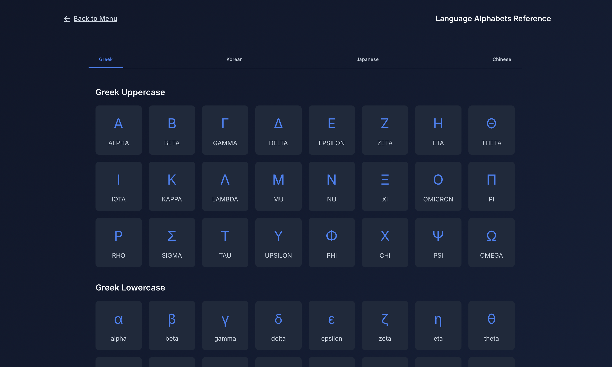
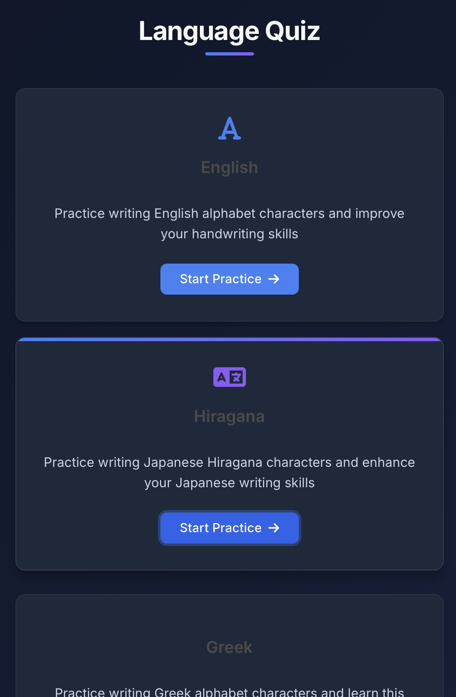
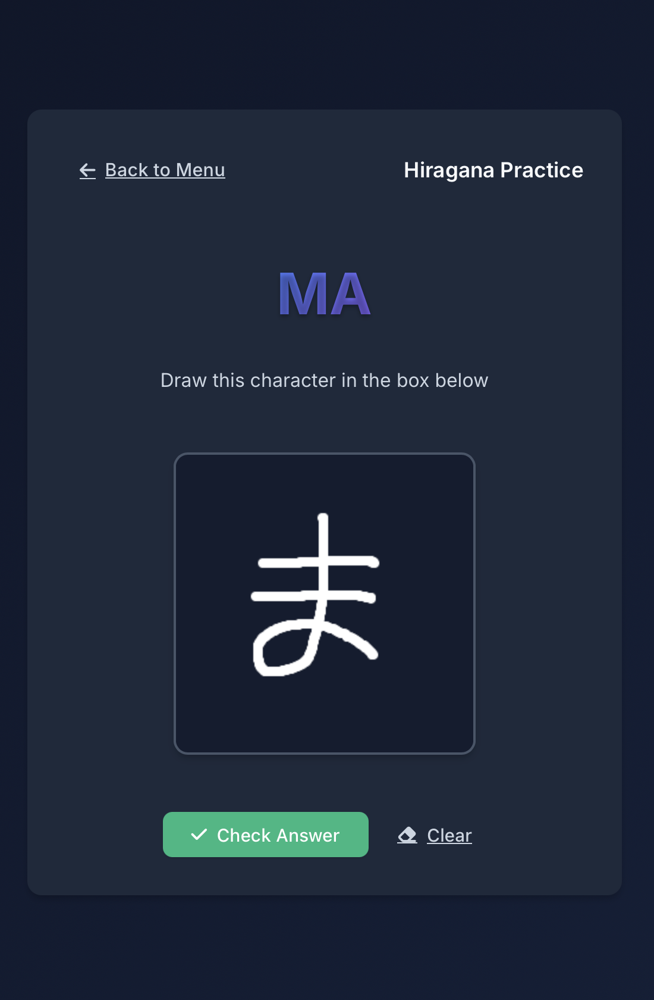

# Language Quiz App

An interactive web application that helps users practice writing characters from different writing systems using machine learning. The app supports English letters, Greek letters, and Japanese Hiragana characters.



## Features

- **Multiple Language Support**:

  - English alphabet (A-Z)
  - Greek alphabet (α-ω)
  - Japanese Hiragana (あ-ん)
- **Interactive Drawing Interface**:

  - Draw characters using your mouse or touch screen
  - Real-time character recognition using machine learning models
  - Immediate feedback on your drawing accuracy
- **Machine Learning Integration**:

  - Uses TensorFlow/Keras models for character recognition
  - Separate models for each writing system
  - Real-time prediction and feedback

## Technology Stack

- **Backend**:

  - Python 3.12
  - Flask (Web Framework)
  - TensorFlow/Keras (Machine Learning)
  - NumPy (Numerical Computing)
- **Frontend**:

  - HTML5
  - CSS3
  - JavaScript
  - Canvas API for drawing

## Installation

1. Clone the repository:

```bash
git clone https://github.com/razeenwasif/language-quiz-app.git
cd language-quiz-app
```

2. Create a virtual environment (recommended):

```bash
python -m venv venv
source venv/bin/activate  # On Windows: venv\Scripts\activate
```

3. Install dependencies:

```bash
pip install -r requirements.txt
```

## Usage

1. Start the Flask application:

```bash
python app.py
```

2. Open your web browser and navigate to:

```
http://localhost:5000
```

3. Select a language to practice:

   - English letters
   - Greek letters
   - Japanese Hiragana
4. Draw the displayed character in the canvas
5. Submit your drawing for instant feedback

## Project Structure

```
language-quiz-app/
├── app.py              # Main Flask application
├── src/               # Source code directory
│   ├── enCharacters.keras  # English character model
│   ├── grCharacters.keras  # Greek character model
│   └── jpCharacters.keras  # Japanese character model
├── templates/         # HTML templates
├── static/           # Static assets (CSS, JS, images)
├── data/             # Training data and labels
└── requirements.txt   # Python dependencies
```

## Contributing

Contributions are welcome! Please feel free to submit a Pull Request.

## License

This project is licensed under the MIT License - see the LICENSE file for details.

## Acknowledgments

- TensorFlow/Keras for the machine learning framework
- Flask for the web framework
- All contributors and users of the application

## Gallery






